# 3 Onboarding Modules and Security Training

## Topics
- [Management Portal](#management-portal)
- [Accessing the Onboarding Tasks](#accessing-the-onboarding-tasks)
- [Signing the ADRF Terms of Use Agreement](#signing-the-adrf-terms-of-use-agreement)
- [Watching the Security Training Video](#watching-the-security-training-video)
- [Complete the Security Training Quiz](#complete-the-security-training-quiz)

## Management Portal
The Management Portal web-based application is positioned primarily as the management and monitoring console for project and data stewards. It provides detailed insight on project configurations, user activity, user onboarding status, and overall cost of a project on the ADRF. We focus on four primary pillars of information a Project/Data Steward most often focuses on:
- **People** – Who are the members of projects, how often do they use the ADRF, what exports have they requested and their status, estimated cost per person/project for current month and for the project since inception, and detailed usage metrics.
- **Projects** – Details of project start/end dates, abstract description, number of members onboarded and pending, and resources the project has access to (i.e. datasets, etc).
- **Datasets** – Description of the dataset, location on the ADRF (database or file system), size, name of the data steward(s), and the link to Enterprise Data Catalog (Informatica) describing the dataset and metadata.
- **Agreements** – What agreements are related to these projects, indication of each member’s signing status, members pending signature, and term (dates) covered by the agreement(s).

As mentioned, the Management Portal application will track your ADRF usage. The protal will also consolidate your ADRF Terms of Use, Security Training Quiz, and Security Training Video into one place. In order to complete ADRF onboarding, all three of the mentioned tasks are to be completed by the user (researcher). To access the Management Portal, log in using your credentials at https://adrf.okta.com and click on the ADRF Management Portal icon:

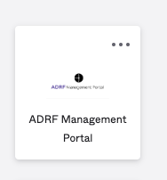

Once inside the Management Portal, you have access to your personal workspace sessions statistics along with admin tasks such as the three onboarding tasks and password management. See the example below:

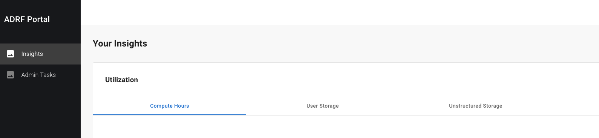 

## Accessing the Onboarding Tasks
To gain access to your ADRF project workspace, you must first complete 3 required ADRF onboarding tasks: 
1. **Signing the ADRF Terms of Use agreement**. Users must comply with the Terms of Use when working in the ADRF. The Agreement covers rules of behavior within ADRF and guidelines for discussing ADRF content prior to passing disclosure review. It asks users to agree to a series of principles governing dataset use, behavior, and data export procedures, and to acknowledge the consequences of violating the Terms.
2. **Completing security awareness training**. Users will get access to a security awareness video and should confirm that they have reviewed the video. The video covers security content that is then assessed during the security awareness quiz.
3. **Passing the security awareness quiz**. The security awareness quiz consists of a set of 6 questions. Users must achieve a score 5 out of 6 to pass the quiz. Unsuccessful users can retake the quiz to achieve a passing score.

Follow the steps below to access the **ADRF Onboarding Tasks**:
1. Log in to the Management Portal

2. Click on **“Admin Tasks”** in the left navigation menu.

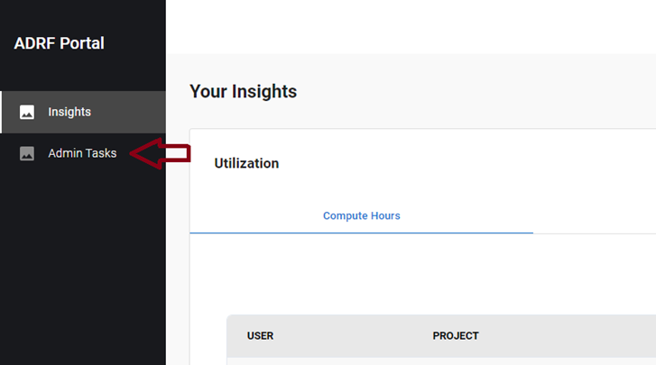 

3. Click on **“Complete Onboarding”**.

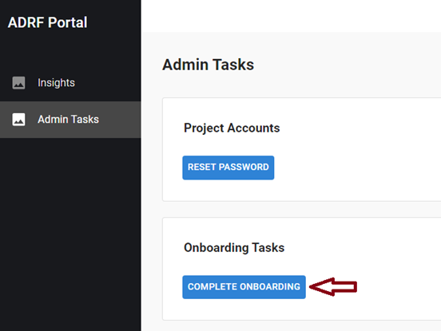

4. This will load the **Onboarding Tasks window**.

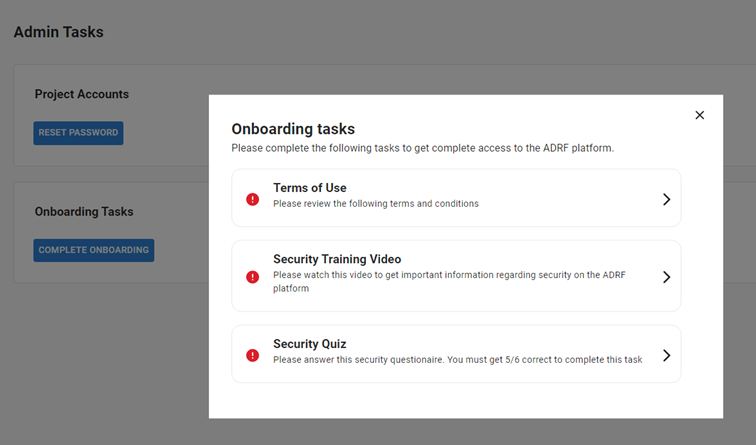

5. Click on each individual task to complete it.

## Signing the ADRF Terms of Use Agreement

The Terms of Use need to be completed before you are given access to the data and project space inside the ADRF. To complete ADRF Terms of Use, complete the following steps:

1. Click on the **“Terms of Use”** tile.

3. Click on **“Sign with DocuSign”**

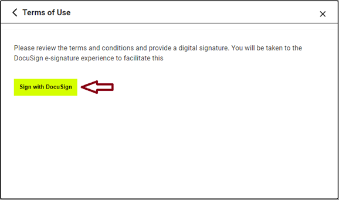

4. You will then be redirected to the DocuSign signing page. **Click “Continue”** on the upper right corner.

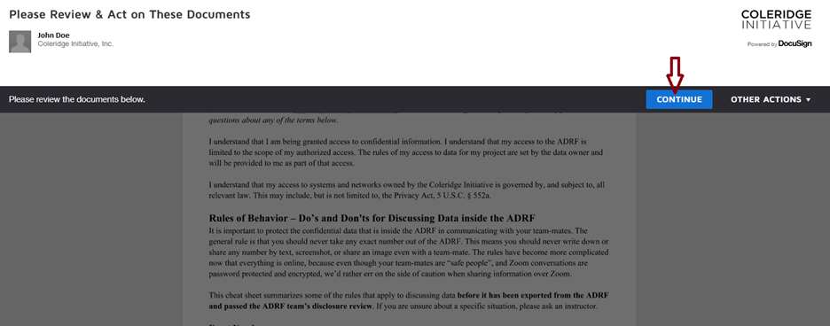

5. Click **“Start”** to begin.

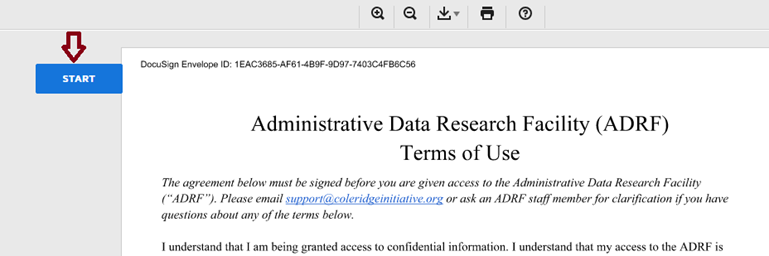

6. If you have already configured a signature, click on the **yellow “Sign” button** to apply it. Otherwise, follow the prompts to configure your electronic signature.

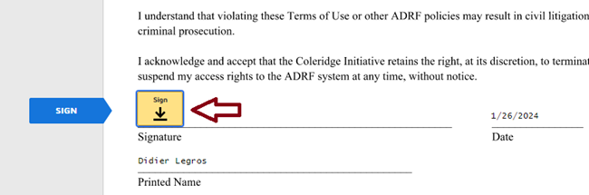

7. Once the signature is applied, click **“Finish”**.

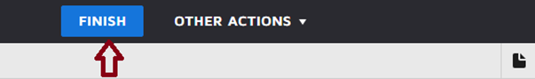

You will then be redirected back to the management portal. And the “Terms of Use” task will be marked as completed.

## Watching the Security Training Video

The Security Training Video needs to be completed as well. To complete the training, complete the following steps:

1. Click on the **“Security Training Video”** tile to load the player and then click play.
2. Once you have watched the video in its entirety, click on the **“Mark as Complete”** button to complete the task. _Note: the “MARK AS COMPLETE” button will not be enabled until at least 5 minutes have passed since the start of the video._
3. Click on the **back arrow** in the upper right corner to return to the main tasks panel.
4. The training video section will now be **marked as completed**.

## Complete the Security Training Quiz

The Security Training Quiz needs to be completed after the Security Training Video. To complete the training, complete the following steps:

1. Click on the **“Security Quiz”** tile to load the quiz.

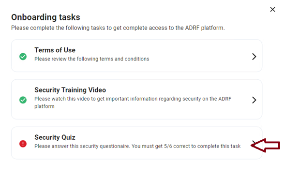

2. Answer the questions and click on the **“SUBMIT RESPONSE”** button. You must answer at least four of the questions correctly to complete this task.

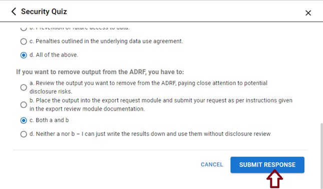

3. You will be automatically redirected to the main task panel once the questionnaire has been successfully completed. And the **“Security Quiz”** will be marked as completed.
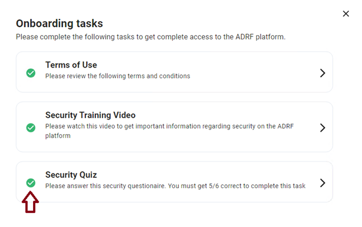 

---

[⬅️ Previous: Obtaining ADRF Access](02-access.md) | [Back to Home](00-cover.md) | [Next: How to Access and Use Your Project Workspace➡️](04-access-and-use.md ))

