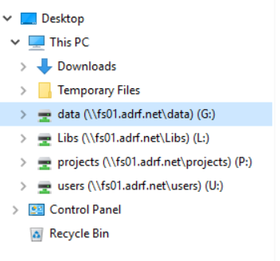

# 5 How to Access Data

This section provides information on how to locate the secure data you’ve been approved to access in the ADRF.

The ADRF offers both unstructured and structured data storage. Data stored in databases are located in the ADRF's structured data storage. Other forms of data, such as flat files, CSVs, documentation, etc. are stored in the ADRF's unstructured data storage.

**External Data and Code**: Please note that importing of external data and code is restricted to only Coleridge staff. Given the secure and protected environment provided by the ADRF, all code, data, and packages that are coming from outside of the ADRF must be carefully vetted to prevent leaks, disclosure, or unauthorized access. This means that there is no direct method for uploading data or code from your system to the ADRF. Please contact support@coleridgeinitiative.org for any questions or assistance on importing your own code, data, or packages.

## Topics
- [Accessing data stored in unstructured data storage](#accessing-data-stored-in-unstructured-data-storage)
- [Accessing data stored in structured data storage](#accessing-data-stored-in-structured-data-storage)

## Accessing data stored in unstructured data storage
Unstructured data, such as CSVs, Stata DTAs, SAS data, are stored in the “G” drive. Project teams will have read-only access to the data folders in this drive that they have been approved to access.

The G: Drive is located in the ADRF's file system. You can find it by going to the Folder icon in the Windows Task Bar.

## Accessing data stored in structured data storage
Structured data, or data that are stored in relational databases, are stored in AWS Redshift, an MPP platform that is built on SQL and is specifically designed to handle larger data assets. Users access structured data either through **DBeaver** – the ADRF's Database Access tool – or by porting directly to Redshift through their preferred **statistical package** (like R, or Python).

For detailed instructions on how to access data in structed data storage, please see the ADRF's [Redshift Querying Guide](11-querying-guide.md)

---

[⬅️ Previous: How to Access and Use Your Project Workspace](04-access-and-use.md) | [Back to Home](00-cover.md) | [Next: Where to Do Your Work ➡️](06-where-to-work.md)
