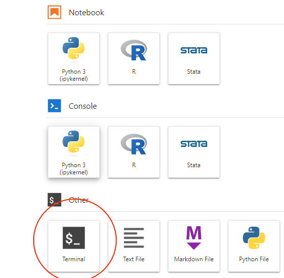

# 10 Adding Additional Packages in R/Python

The ADRF has an internal package repository, so users can install packages for R and Python themselves.

The repositories that are currently mirrored in the ADRF are [CRAN](https://cran.r-project.org/) for R packages and [PyPi.org](https://coleridge-initiative.github.io/adrf_onboarding_handbook/packages.html#:~:text=The%20repositories%20that%20are%20currently%20mirrored%20in%20the%20ADRF%20are%20CRAN%20for%20R%20packages%20and%20PyPi.org%20for%20Python.%20There%20is%20currently%20no%20access%20to%20packages%20hosted%20on%20Github%20or%20other%20mirrors.) for Python. There is currently no access to packages hosted on Github or other mirrors.

**Note**: If you are working in a shared workspace for a project, each user in the project must install the packages, there is no shared package installation for projects.

## Topics
- [Add additional R packages](#add-additional-r-packages)
- [Add additional Python packages](#add-additional-python-packages)

## Add additional R packages

To install R packages, simply use the code below and the package will be installed from the repository. You will not have to re-install the package again, and to use the package load it with the library() function. For example:

``` r
install.packages("packagename")
```

** Example**: Installing `tidyverse`


To install a specific package version you can specify:

``` r
install.packages("remotes")

remotes::install_version("tidyverse", "1.3.2")
```

**Note**: We recommend starting R using Rstudio for best results, instead of double clicking on a R or Rmarkdown script.

## Add additional Python packages

Similar to R packages, Python packages may be installed using the Package Installer for Python (pip).

**Note**: We recommend installing python packages from the command line. If you start Jupyter lab, and choose the Terminal tab:



Then install your package using pip, for example, to install the pandas package:


Then you may use the package within your Jupyter notebook as usual.

To install a **specific package version** type: 
``` python
pip install pandas==1.2.3
```

---
[⬅️ Previous: Do's and Don'ts for Discussing Data Hosted in the ADRF](09-dos-and-donts.md) | [Back to Home](0-cover.md) | [Next: Redshift Querying Guide ➡️](11-querying-guide.md)
